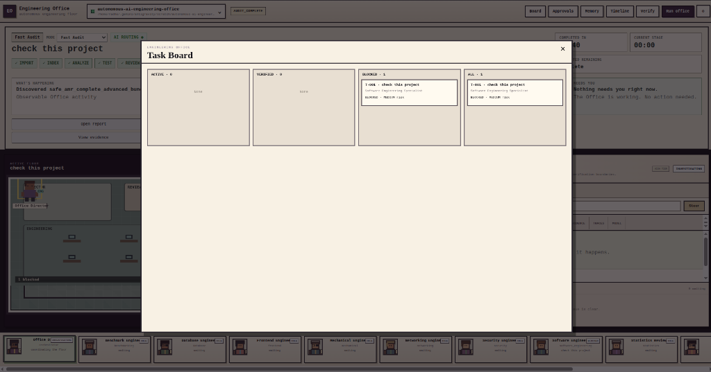
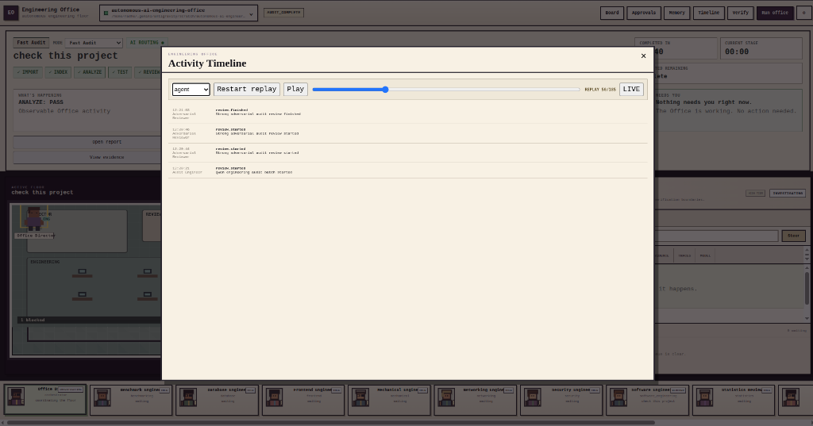
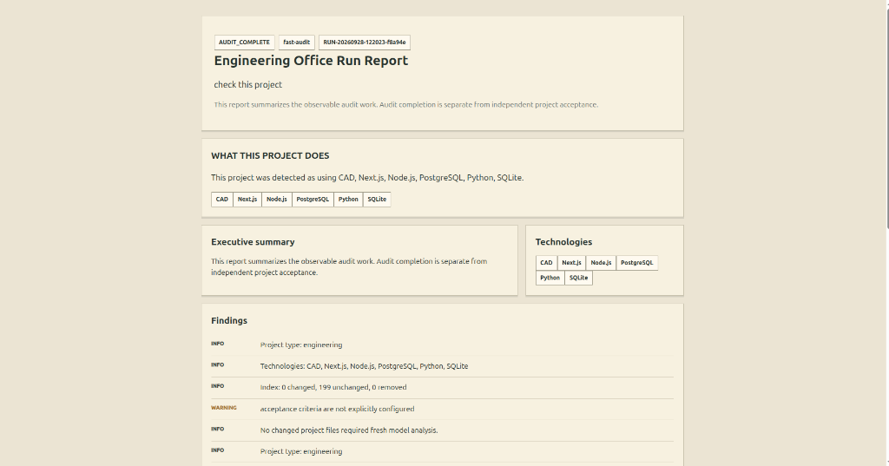

<h1 align="center">Autonomous AI Engineering Office</h1>
<p align="center">A local-first, evidence-driven runtime for planning, executing, and independently checking engineering work.</p>

<p align="center">
  
</p>

**The Autonomous AI Engineering Office is free and open source under the MIT License. It runs an observable engineering workflow on your machine, with local model support and optional cloud routing. Evidence, configured acceptance checks, and an independent verifier determine the reported result; a model's assertion alone does not.**

[](https://www.python.org/)
[](pyproject.toml)
[](LICENSE)
[](#tests)
[](#privacy-and-zero-cost-routing)
[](#privacy-and-zero-cost-routing)
[](RELEASE_INFO.txt)
[](#contributing)

**Quickstart:** install the package, then run the offline demo:

```sh
python -m pip install -e .; office demo
```

> **Note:** The demo uses a deterministic scripted provider, creates a disposable calculator project, and runs its acceptance test. It demonstrates the workflow, not a guarantee that arbitrary project changes will pass. A real run can end in `PASS`, `FAIL`, `BLOCKED`, or a limited audit result depending on evidence and available capabilities.

## Contents

- [What it is](#what-it-is)
- [How it works](#how-it-works)
- [The four rules](#the-four-rules)
- [Features](#features)
- [Privacy and zero-cost routing](#privacy-and-zero-cost-routing)
- [Getting started](#getting-started)
- [CLI reference](#cli-reference)
- [Architecture](#architecture)
- [Roadmap](#roadmap)
- [Contributing](#contributing)
- [Security](#security)
- [License](#license)
- [Citation](#citation)

## What it is

The Office is a Python engineering runtime and local Control Room for working against an existing project and an explicit objective. It discovers project context, staffs specialists, plans tasks, runs scoped tools, records evidence, reviews proposed work, and invokes an independent verifier against configured acceptance gates.

It is an orchestrator and safety boundary, not a built-in implementation of every engineering tool. Model endpoints and project-specific systems are configured or connected through adapters. The optional Electron desktop shell hosts the same Python Control Room; it is not required.

## How it works

```text
Project + objective
        |
        v
 Discovery -> Staffing -> Plan / task DAG
                            |
                            v
 Proposal -> Evidence and review -> Scoped tool execution
                                           |
                                           v
                                  Tests / measurements
                                           |
                                           v
                              Independent verification
                                  /       |       \
                               PASS     FAIL    BLOCKED
                                  |                 |
                                  v                 v
                       Delivery when eligible   Report limits
```

1. **Inspect and plan.** Project discovery records technologies, files, and other project evidence. The Office creates specialists and a task plan; model-based planning is optional.
2. **Propose and act within scope.** Specialists use their allowed tools and read/write scopes. Risky actions can require operator approval. The `--auto` flag does not bypass high-risk approval.
3. **Capture and review evidence.** Tool results, checks, events, and artifacts are persisted under the project’s `.office/` state. Review and critique are distinct stages from implementation.
4. **Verify and report.** The verifier evaluates configured gates and required evidence. Delivery is available only when its required task and project states are satisfied. An audit being complete is not the same as the project passing its acceptance gates.

## The four rules

1. **A worker does not certify its own work.** The Office has review and verification stages separate from proposal generation.
2. **Evidence matters more than agreement.** Passing configured checks and the verifier’s evidence-based result matter; multiple model opinions do not substitute for them.
3. **Acceptance criteria are protected.** The Office snapshots and hashes acceptance specifications before candidate execution. Mutation is treated as a verification failure.
4. **Missing capability is not success.** The Office can report `BLOCKED` when work cannot be verified. Fast Audit can report `AUDIT_COMPLETE_LIMITED` when required analysis is unavailable. `AUDIT_COMPLETE` means the audit finished, not that the project passed.

## Features

| What you get | In the project |
|---|---|
| **A working engineering floor.** Inspect the project floor and select agents to see their tasks and recorded activity. |  |
| **A task board and project switcher.** Review work and switch between registered local project floors. |  |
| **A recorded activity timeline.** Follow runtime events and tool activity from a run. |  |
| **A permanent run report.** Open the Markdown and HTML-style report views produced for a run. |  |

### Engine

- Project discovery, dynamically staffed specialists, task contracts, dependency scheduling, and bounded parallel execution.
- OpenAI-compatible model endpoints, configurable routing by complexity, and a deterministic provider used by the offline demo.
- Optional model lifecycle management for configured local model servers.
- Project intake from supported folders, files, archives, pasted content, Git sources, or a new project through the Control Room.

### Evidence and verification

- Scoped filesystem, search, shell, and Git tools with project-root checks and approval handling for risky actions.
- Evidence artifacts, structured events, run records, and incremental SHA-256 project indexing.
- Evidence Analyst, Domain Reviewer, and Adversarial Critic feedback stages.
- Independent `PASS`, `FAIL`, or `BLOCKED` verification against configured acceptance gates and required evidence.
- Fast Audit and Check & Report modes that are report-first and restrict project mutation. The Office still writes its own `.office/` state and reports.

### Control and safety

- Local Control Room with project floors, task board, agent inspector, evidence, approvals, and run controls.
- Operator pause, resume, stop, objective change, agent replacement, and approval commands.
- Loopback-only Control Room serving by default; non-loopback hosts are rejected.
- Optional Electron desktop wrapper with an isolated renderer. The Python CLI and Control Room work without Electron.
- Extension interfaces for external tools, engineering-agent CLIs, and research providers. A CAD solver, browser automation engine, database, or robotics system is not bundled as a native capability merely because an adapter can connect one.

## Privacy and zero-cost routing

The core can run with no cloud credentials. LOW and MEDIUM work tries a configured local provider first. HIGH and ESCALATION review routes are cloud-first when cloud routes are configured, then may fall back to a local provider. Cloud providers and local models require your own configuration; the repository does not include model weights or API credentials.

Cloud spend is **provider-dependent**, not guaranteed to be zero. OpenRouter checks model pricing before using a model and rejects a selected model that is not verified as zero-price. Other free-tier providers are treated as unverified unless you explicitly enable them with `OFFICE_ALLOW_UNVERIFIED_FREE_TIER=1`; verify your account’s billing terms before opting in. The example `.env.example` contains placeholders and settings, not credentials. Its `MAX_CLOUD_COST_USD` and `ZERO_COST_ONLY` entries should not be read as a universal billing cap implemented by the runtime.

Before cloud requests, the provider path redacts detected secrets. This is not a promise that source code or other prompt content can never be sent: review/escalation requests may include task context. Routine cloud source snippets are disabled unless `OFFICE_ALLOW_CLOUD_SOURCE_SNIPPETS` is enabled. Use local-only configuration and do not configure cloud credentials when project content must remain on the machine. For production work, use OS or container isolation and least-privilege credentials as described in [Security](docs/SECURITY.md).

Optional user-level provider configuration can be placed at `~/.engineering-office/.env`:

```sh
mkdir -p ~/.engineering-office
cp .env.example ~/.engineering-office/.env
```

On Windows, create the directory and copy the file with Explorer or PowerShell. Replace only the provider values you intend to use, and do not commit real secrets.

## Getting started

### Prerequisites

- Python 3.11 or newer.
- Git for Git-backed project operations.
- For model-assisted work, an OpenAI-compatible local or remote endpoint configured in JSON, or an eligible configured cloud provider. No model server is required for `office demo`.
- Optional: Node.js and npm for the Electron shell in `desktop/`.

### Install

From the repository root:

```sh
python -m pip install -e .
office doctor .
```

### Offline demo

```sh
office demo --workspace /tmp/engineering-office-demo
```

The command creates a deliberately faulty calculator project, uses the built-in scripted response, runs a unittest acceptance gate, and creates a delivery bundle when verification passes. The workspace must be empty or absent; use `--force` only for a dedicated disposable demo directory because it removes an existing non-empty target.

### Control Room

Open a local project in the browser, or prefer an app-style browser window where supported:

```sh
office ui /path/to/project
office ui /path/to/project --app
```

The server binds to loopback by default and keeps running until stopped. `--no-open`, `--host`, and `--port` are also available. Only loopback hosts are accepted.

### Fast Audit

For a read-only, report-first run:

```sh
office run /path/to/project --mode fast-audit --objective "Summarize the project and identify issues"
office report /path/to/project
```

`check-report` is another read-only mode. `AUDIT_COMPLETE` does not mean acceptance gates passed; inspect the report’s separate verification result. See [Fast Audit](docs/FAST_AUDIT.md).

### Run against a real objective

Set up a model endpoint in a JSON configuration based on [examples/model_profiles.json](examples/model_profiles.json), ensure that endpoint is reachable, and add `acceptance.json` to the project before starting if you have project-specific gates. The example model URLs are placeholders and are not hosted services.

```sh
office start /path/to/project --objective "Investigate the failing tests and propose a minimal repair"
office run /path/to/project --config /path/to/office-config.json --auto
office verify /path/to/project
office report /path/to/project
```

`--auto` executes eligible low-risk local work automatically. It does not bypass high-risk approvals. Review the plan and copied acceptance specification under `.office/` before execution. Without a working provider or required evidence, a run may be `BLOCKED` or limited rather than successful.

### Optional desktop shell

The desktop shell is an optional Electron wrapper around `office ui`:

```sh
cd desktop
npm install
```

Then set `OFFICE_PROJECT` to an absolute project path and run `npm start`. See [desktop/README.md](desktop/README.md) for Windows-specific environment setup and other options.

### Tests

Run the repository suite with:

```sh
pytest -q
```

**Observed on Windows with Python 3.14.6:** `326 passed, 4 failed, 1 skipped` (331 collected). The first run without Python UTF-8 mode failed test collection while reading UTF-8 UI files; with UTF-8 mode enabled, the four failures were in ETA rounding, approval/resume behavior, SQLite index recovery, and terminal path redaction. This is not a green test-suite claim. Run the suite in your target environment before relying on it; the version declared by the project starts at Python 3.11.

## CLI reference

Use `office help` or `office COMMAND --help` for the installed CLI’s argument details. `PATH` below is a project directory unless noted.

| Command | Purpose |
|---|---|
| `office demo [--workspace PATH] [--force]` | Run the deterministic offline demo. |
| `office init [PATH]` | Initialize Office state and a default config. |
| `office doctor [PATH]` | Check Python, Git, pytest, and Office state. |
| `office inspect [PATH] [--objective TEXT]` | Inspect project evidence. |
| `office staff [PATH] [--objective TEXT]` | Preview discovered specialist staffing. |
| `office start PATH --objective TEXT [--config FILE] [--plan-with-model]` | Start a project and create its plan. |
| `office plan [PATH]` | Print the saved plan. |
| `office run [PATH] [--config FILE] [--mode MODE] [--objective TEXT] [--max-iterations N] [--parallelism N] [--simulation] [--auto]` | Run the configured workflow. Modes: `fast-audit`, `check-report`, `fix`, `complete`, `custom`. |
| `office verify [PATH]` | Run independent verification. |
| `office status [PATH]`, `office memory [PATH]`, `office deliver [PATH]` | Inspect status or memory, or create eligible delivery output. |
| `office report [PATH] [--run-id ID]` | Show the latest or selected permanent run report. |
| `office index status [PATH]`, `office index rebuild [PATH]` | Inspect or rebuild the project index. |
| `office benchmark [KIND] [TARGET] [PATH] [--input FILE] [--results FILE]` | Aggregate benchmark results or evaluate supported runtime benchmark inputs. |
| `office ui [PATH] [--host LOOPBACK] [--port PORT] [--no-open] [--app]` | Launch the local Control Room. |
| `office intake SOURCE DESTINATION [--zip]` | Import a directory or ZIP archive with the CLI intake command. |
| `office plan-model [PATH] --config FILE [--tier LOW\|MEDIUM\|HIGH\|ESCALATION]` | Generate a plan using a configured model. |
| `office pause [PATH]`, `office resume [PATH] [--reset-blocked]`, `office stop [PATH]` | Control a run. |
| `office approvals [PATH]`, `office approve [PATH] ID`, `office deny [PATH] ID` | Review and resolve pending approvals. |
| `office objective [PATH] --set TEXT` | Update a project objective. |
| `office replace-agent [PATH] --old NAME --expertise TEXT` | Replace a specialist. |
| `office model status [PATH] --config FILE`; `office model start\|switch\|stop NAME [PATH] --config FILE`; `office model stop-all [PATH] --config FILE`; `office model cold-start [PATH] --config FILE --sequence NAMES [--output FILE]` | Inspect/control configured Office-owned local model servers. |

The benchmark command does not accept `--suite`; use `office benchmark --input results.json` for result aggregation. Runtime benchmark kinds and required result shapes are described in [docs/BENCHMARKS.md](docs/BENCHMARKS.md).

## Architecture

| Area | Responsibility |
|---|---|
| `cli.py` | Command-line interface and argument parsing. |
| `office.py`, `planning.py`, `scheduler.py` | Project orchestration, task planning, and scheduling. |
| `discovery.py`, `capabilities.py`, `agent_factory.py` | Project discovery and dynamic specialist staffing. |
| `agent_runtime.py`, `models_runtime.py`, `routing.py` | Agent protocol, model endpoints, routing, and local model lifecycle. |
| `tools.py`, `security.py`, `approvals.py` | Scoped tool execution, path/risk checks, and operator approval. |
| `feedback.py`, `verification.py` | Review/critique and independent acceptance verification. |
| `evidence.py`, `storage.py`, `run_records.py`, `reporting.py` | Evidence artifacts, SQLite state, run history, and reports. |
| `ui_server.py`, `ui_service.py`, `ui/` | Loopback Control Room server and web interface. |
| `desktop/` | Optional Electron host for the Python Control Room. |

See [docs/ARCHITECTURE.md](docs/ARCHITECTURE.md) for boundaries and data flow, and [docs/FEATURE_MATRIX.md](docs/FEATURE_MATRIX.md) for implementation and test mapping.

## Roadmap

The items below distinguish shipped foundations from capability boundaries. Unchecked items are possible extensions, not release commitments.

- [x] Python CLI, deterministic offline demo, project discovery, planning, and scoped tool execution.
- [x] Evidence capture, review stages, acceptance snapshots, and independent verification.
- [x] Loopback Control Room, run history, reports, and optional Electron wrapper.
- [ ] Provide first-party built-in integrations for systems that currently require external adapters, such as CAD/EDA, databases, browser automation, and robotics tooling.
- [ ] Add a native PTY-backed terminal for external CLI agents. The current Control Room terminal reconstructs Office tool/execution evidence; it is not a PTY multiplexer.

## Contributing

Contributions are welcome. Start with a focused change, include reproducible evidence or tests where applicable, and be precise about what was verified. The project test suite currently has environment-specific failures as noted above, so report your test environment and results rather than implying a clean run. For extension interfaces and capability boundaries, see [docs/EXTENDING.md](docs/EXTENDING.md).

## Security

Do not provide autonomous workers unrestricted production credentials. Use a dedicated checkout, OS or container sandbox, and least-privilege accounts for real projects. The Office applies project path guards, scoped tools, and high-risk approval gates, but these application controls do not replace operating-system isolation. Report security issues privately to the maintainer rather than posting secrets or exploitable details publicly. See [docs/SECURITY.md](docs/SECURITY.md).

## License

The project source is available under the MIT License. See [LICENSE](LICENSE).

## Citation

If you reference this project, you may cite the repository as:

```bibtex
@software{autonomous_ai_engineering_office_2026,
  author = {Nikhilesh R Sahu and Autonomous AI Engineering Office Contributors},
  title = {Autonomous AI Engineering Office},
  version = {0.1.0},
  year = {2026},
  url = {https://github.com/NikhileshRSahu/autonomous-ai-engineering-office}
}
```
