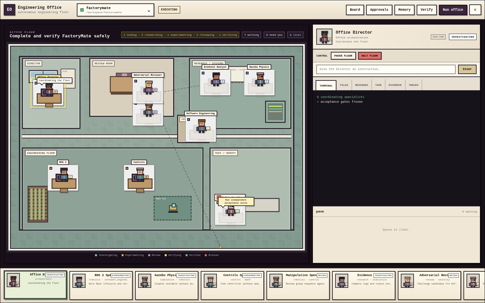

# Engineering Office Control Room V2

The Control Room is the local operator surface for the Autonomous AI Engineering Office. It is intentionally not a conventional analytics dashboard. The primary mental model is a **working engineering office**: specialists occupy the floor, the roster is always available, and selecting one worker opens that worker's live engineering context.

The UI is only a control surface over the same `OfficeEngine`, task store, evidence store, approvals, feedback system, model router, and verifier used by the CLI. It does not create a second or weaker execution path.

## 1. Launch

```bash
office ui /absolute/path/to/project --app
```

Alternatives:

```bash
# Default browser
office ui /absolute/path/to/project

# Serve without opening a window
office ui /absolute/path/to/project --no-open

# Choose another loopback port
office ui /absolute/path/to/project --port 9000
```

Only loopback hosts are accepted. Non-loopback binding is rejected because this surface can approve and control real engineering work.


## 2. Universal project intake

The startup screen and `+ New Floor` open the same universal intake modal. The operator can choose: **Folder**, **Files / Archive**, **Paste**, **Git**, or **New project**. Drag/drop and browser folder selection are supported, and the optional Electron shell adds native folder/file/archive pickers through a narrow preload bridge.

The UI shows explicit stages such as Uploading, Validating, Extracting, Detecting project root, Opening floor, and Staffing team. Form contents are preserved after recoverable failures. A backend outage is reported as an actionable `Office backend unreachable` message rather than raw `Failed to fetch`.

A successful intake opens/materializes a floor but does not silently execute the project. Existing initialized floors can still be opened directly. Managed sources preserve provenance (`source_kind`, `source_name`, `managed`) in the floor registry and `.office/intake.json`.

## 3. Four-region layout

The control room has four persistent regions:

1. **Office chrome** — current floor/project and global utility actions.
2. **Living office floor** — Director room, engineering desks, review/research areas, and QA/verification area.
3. **Selected-agent inspector** — controls, steering, tabs, and queue for one worker.
4. **Agent roster** — a persistent process switcher along the bottom.

The floor is generated from real Office staffing. It is not a fixed cast of characters.

## 4. Multiple project floors

Each project is one floor. The floor selector opens an existing project or creates/switches to another local project path.

Each floor keeps separate:

- specialists;
- task graph and task state;
- messages/queues;
- evidence;
- approvals;
- organizational memory;
- configuration/model routing;
- repository/worktree state.

The floor registry records project locations but does not merge project state.

## 5. Living floor and engineering states

Specialists are positioned according to their role and shown with a runtime state. The visual state is derived from Office/task/feedback state rather than decorative animation.

Typical states include:

- **Investigating** — reading/searching/diagnosing;
- **Experimenting** — running a test, tool, build, benchmark, or experiment;
- **Awaiting review** — candidate reasoning/change has reached review;
- **Verifying** — independent verification is active;
- **Verified** — acceptance evidence passed;
- **Blocked** — dependency, evidence, permission, or external capability is missing;
- **Paused** — operator has temporarily suspended the worker;
- **Halted** — operator has stopped the worker until explicit resume.

No color/state by itself constitutes verification. Authoritative PASS still comes from the verifier.

## 6. Persistent agent roster

The bottom roster is always visible. Selecting an agent switches the inspector immediately without navigating away from the floor.

The roster includes the Office Director and the dynamically staffed specialists. `+ Add Agent` creates an additional specialist through the real `AgentFactory`; it is not a cosmetic card.

## 7. Selected-agent inspector

The right-side inspector is the primary debugging and supervision surface.

### Terminal

Shows the selected agent's reconstructed execution transcript. Where execution evidence exists it includes the actual tool name, preserved arguments/command/path, reason for the action, stdout/stderr and return code. When no tool execution exists yet, the event stream is used as a fallback.

The current Python runtime is not a PTY multiplexer: this view reconstructs the authoritative tool/execution evidence generated by the Office. External CLI agents can still be attached through the existing command-agent adapter. A future native PTY adapter can use the same inspector contract without changing the rest of the UI.

### Files

Shows files currently touched/changed for that agent's project context, falling back to the specialist's declared write scopes when no change is present.

### Messages

Shows structured durable messages involving that agent.

### Task

Shows the current owned task, status, dependencies, risk/complexity and acceptance context.

### Evidence

Shows evidence associated with the selected specialist/task.

### Traces

Shows the structured Office event/tool/model trace relevant to the worker.

## 8. Queue and steering

The Queue is the selected worker's durable incoming work/context stream.

`Steer` adds operator guidance to that worker without replacing the entire task. Steering is persisted as an agent message and is injected into subsequent model context, so it affects real reasoning instead of merely changing the UI.

The Director input retains project-level objective/command behavior; specialist steering remains scoped to the selected worker.

## 9. Per-agent controls

Each specialist supports:

- **Pause** — prevent owned tasks from executing until resumed;
- **Halt** — stop the specialist at a safe Office boundary;
- **Resume** — return the specialist to running state and optionally requeue its blocked owned tasks;
- **Steer** — add scoped operator context.

Control state is persisted under `.office/` and survives UI refreshes.

## 10. Global Director controls

Global controls remain separate from worker controls:

- Run Office;
- Verify;
- Pause Office;
- Resume Office;
- Stop Office at a safe boundary;
- update project objective.

The Director coordinates the project but cannot independently declare PASS.

## 11. Utility surfaces

The top-level utility actions deliberately remain secondary to the floor:

- **Board** — task/dependency status;
- **Approvals** — high-risk actions waiting for human authorization;
- **Memory** — verified lessons, failed attempts and rejected hypotheses;
- **Settings** — model endpoint/routing and project control state;
- **Verify** — independent acceptance run;
- **Run Office** — continue execution.

Approving an action grants permission to attempt it. It never marks the result correct.

## 12. Optional Electron desktop shell

`desktop/` contains an optional thin Electron host for users who want a dedicated native-looking application window.

```bash
cd desktop
npm install
OFFICE_PROJECT=/absolute/path/to/project npm start
```

Useful environment variables:

- `OFFICE_PROJECT` — project/floor path;
- `OFFICE_BIN` — alternate `office` executable;
- `OFFICE_UI_PORT` — fixed local port if desired.

The wrapper:

- starts the Python Office UI on loopback;
- waits for `/api/health`;
- opens the same production control room;
- uses `contextIsolation: true`, `sandbox: true`, and `nodeIntegration: false`;
- refuses navigation or popup handoff to non-local origins;
- shuts down its child UI server when the desktop app exits.

Electron is optional and is not bundled in the Python wheel. `office ui --app` remains the zero-Node app-window path.

## 12. Architecture

```text
Desktop/browser control room
        │
        ▼
OfficeUIServer (loopback HTTP)
        │
        ▼
DashboardService / control-room service
        │
        ├── FloorRegistry
        ├── OfficeEngine
        │     ├── AgentControlManager
        │     ├── Scheduler / task DAG
        │     ├── AgentRuntime / providers
        │     ├── Feedback loop
        │     └── independent Verifier
        ├── ApprovalManager
        ├── EvidenceStore
        ├── CommunicationManager
        ├── MemoryManager
        └── DeliveryManager
```

## 13. Local safety properties

- loopback-only serving;
- project switching resolves and validates requested directories;
- per-agent controls use Office authority rather than bypassing it;
- evidence/artifact access remains scoped;
- project path escape and symlink protections remain active in execution tools;
- acceptance gates remain independent of worker claims;
- no CDN, analytics script or externally hosted UI dependency is required;
- Electron renderer has no direct Node integration and cannot navigate off the Office origin.

## 14. Verification coverage

The repository tests cover:

- persistent pause/halt/resume;
- steering persistence and injection into actual model context;
- floor registry isolation;
- selected-agent details, terminal reconstruction, files, queue, evidence and traces;
- floor/agent/control HTTP routes;
- control-room static structure and engineering-state CSS;
- action argument/reason retention for terminal reconstruction;
- optional Electron shell security/configuration;
- the existing project discovery, staffing, planning, feedback, approval, evidence, verification, memory and delivery runtime.

The release screenshot is generated with the production HTML/CSS/JavaScript against a real captured Office snapshot in a browser engine. The execution environment used to build this project blocks direct browser navigation to localhost, so HTTP correctness is tested independently against the real local server while visual/interaction rendering uses the same production assets with a captured API snapshot.

## Living engineering floor

The floor is a live visualization of Office state rather than a decorative dashboard. Each specialist is rendered as an original local pixel-style engineer with a deterministic visual identity. Their location and animation follow the current task state:

- research/evidence work moves toward **Research / Systems**;
- implementation and experiments stay on the **Engineering Floor**;
- review and escalation move to the **Review Room**;
- tests and acceptance verification move to **Test / Verify**;
- completed/idle workers can move to the **Coffee** area;
- blocked workers visibly signal attention.

Recent agent-to-agent handoffs are drawn on the floor, and the current attention target can surface a speech bubble. The persistent roster and selected-agent inspector use the same pixel identity, while all existing terminal, files, messages, task, evidence, traces, steer, pause, resume, and halt controls remain unchanged.

Animations respect `prefers-reduced-motion` and require no external image or font assets.



## Living Office runtime view

The floor is driven by `.office/runtime/events.jsonl`, not by decorative task guesses. The selected-agent TERMINAL tab uses `/api/agents/<agent>/terminal`; Timeline and Replay use the read-only event APIs. See `docs/RUNTIME_OBSERVABILITY.md` for the event contract, character behavior, replay rules, verifier authority, and no-hidden-reasoning policy.
